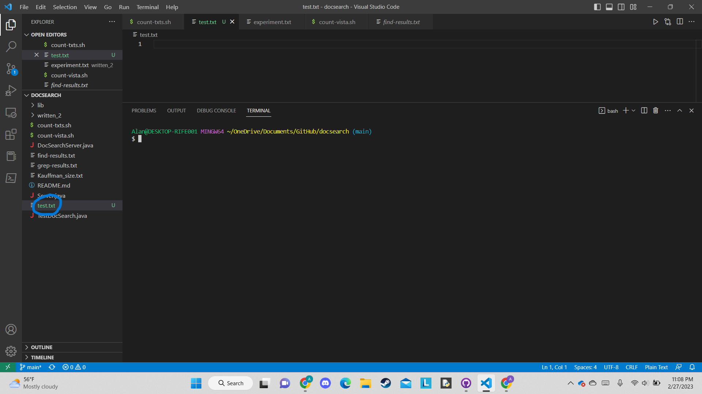
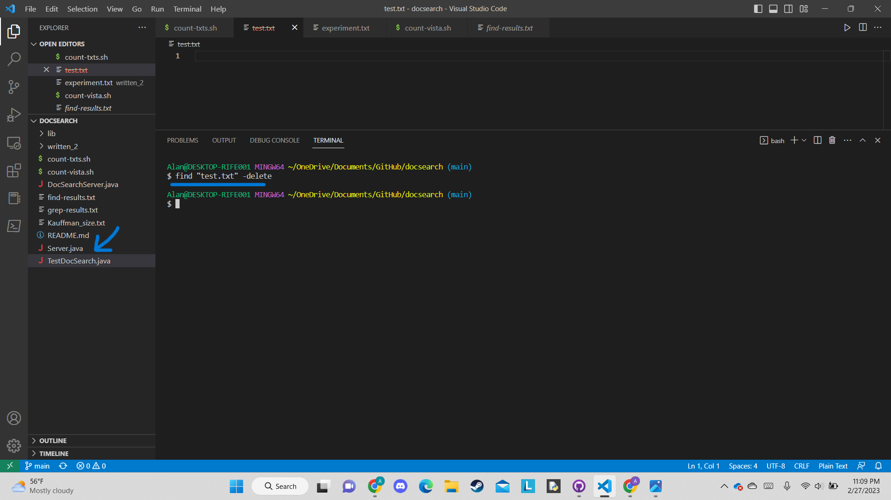

I chose to research the find command. 4 interesting command-line options that I found were -delete, -cmin, -atime, -user.

The first command was -delete. This command allows you to delete files that are returned by find.

If we were to run find "test.txt" -delete, the file "test.txt" will be deleted from the directory. 

